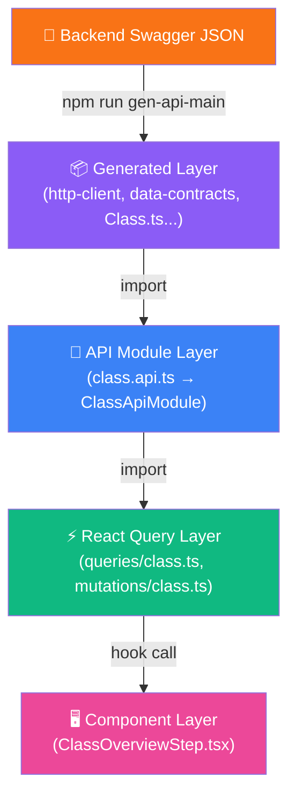

# PickleConnect — API Generation & Calling Flow

> Tài liệu tổng hợp toàn bộ pipeline từ **Swagger Codegen** đến **Component gọi API** trong dự án Next.js.
> Có thể dùng làm template khi setup dự án mới.

---

## 1. Tổng Quan Kiến Trúc (4 Layers)



| Layer           | Thư mục                         | Vai trò                                                    |
| --------------- | ------------------------------- | ---------------------------------------------------------- |
| **Generated**   | `services/apis/main/generated/` | Auto-gen từ Swagger. **KHÔNG SỬA TAY**                     |
| **API Module**  | `services/apis/main/modules/`   | Wrap generated class, thêm error handling, format response |
| **React Query** | `services/react-query/`         | `useQuery` / `useMutation` hooks, cache invalidation       |
| **Component**   | `modules/`                      | Chỉ gọi React Query hook. **KHÔNG gọi API trực tiếp**      |

---

## 2. Codegen — Từ Swagger → TypeScript

### 2.1 Công cụ: `swagger-typescript-api`

```bash
# Cài trong package.json scripts (KHÔNG cần install global)
npx swagger-typescript-api@13.0.16
```

### 2.2 NPM Scripts

```json
{
  "scripts": {
    "gen-api-main": "npx swagger-typescript-api@13.0.16 --axios --modular --extract-request-params --extract-request-body --extract-response-body --extract-response-error --module-name-index 1 -p http://localhost:5000/swagger/v1/swagger.json -o src/services/apis/main/generated",
    "gen-api-identity": "npx swagger-typescript-api@13.0.16 --axios --modular --extract-request-params --extract-request-body --extract-response-body --extract-response-error --module-name-index 1 -p https://your-server/swagger/v1/swagger.json -o src/services/apis/main/generated"
  }
}
```

### 2.3 Giải thích các flags

| Flag                       | Ý nghĩa                                                                           |
| -------------------------- | --------------------------------------------------------------------------------- |
| `--axios`                  | Dùng Axios làm HTTP client (thay vì fetch)                                        |
| `--modular`                | Tách ra nhiều file theo controller (Class.ts, User.ts...) thay vì 1 file khổng lồ |
| `--extract-request-params` | Tách params type thành type riêng (ClassListParams...)                            |
| `--extract-request-body`   | Tách request body thành type riêng (CreateClassCommand...)                        |
| `--extract-response-body`  | Tách response body thành type riêng (ClassCreateData...)                          |
| `--extract-response-error` | Tách error response thành type riêng (ClassCreateError...)                        |
| `--module-name-index 1`    | Dùng segment thứ 2 của URL path làm tên module (vd: `/api/class` → `Class`)       |
| `-p <url>`                 | URL của Swagger JSON (backend phải đang chạy)                                     |
| `-o <path>`                | Output directory                                                                  |

### 2.4 Output — Các file được generate

```
src/services/apis/main/generated/
├── http-client.ts          ← Base HttpClient class (Axios wrapper)
├── data-contracts.ts       ← TẤT CẢ types/interfaces (DTOs, Commands, Params...)
├── Class.ts                ← API methods cho Class controller
├── User.ts                 ← API methods cho User controller
├── Club.ts                 ← API methods cho Club controller
├── Tournament.ts           ← ...
└── ... (mỗi controller = 1 file)
```

> [!CAUTION]
> **KHÔNG ĐƯỢC sửa bất kỳ file nào trong `generated/`**. Chạy lại `gen-api-main` sẽ ghi đè toàn bộ.

---

## 3. Layer 1 — Generated HttpClient & Controller Classes

### 3.1 `http-client.ts` — Base class

```typescript
// Auto-generated, cung cấp:
export class HttpClient<SecurityDataType = unknown> {
  public instance: AxiosInstance; // Axios instance
  public setSecurityData(data): void; // Set token cho securityWorker
  public request<T, E>(params): Promise<AxiosResponse<T>>; // Core request method
}
```

**Cơ chế authentication**: Dùng `securityWorker` pattern:

- `securityWorker` là function nhận token, trả về headers config
- Khi `secure: true` → tự động gọi `securityWorker` để inject Bearer token

### 3.2 Controller class (vd: `Class.ts`)

```typescript
// Mỗi endpoint trong Swagger → 1 method
export class Class<SecurityDataType> extends HttpClient<SecurityDataType> {
  // POST /api/class → classCreate()
  classCreate = (data: CreateClassCommand, params?) =>
    this.request<ClassCreateData, ClassCreateError>({
      path: `/api/class`,
      method: 'POST',
      body: data,
      secure: true, // ← Cần auth
      type: ContentType.Json,
      format: 'json',
    });

  // GET /api/class → classList()
  classList = (query: ClassListParams, params?) =>
    this.request<ClassListData, ClassListError>({
      path: `/api/class`,
      method: 'GET',
      query: query,
      secure: true,
      format: 'json',
    });
}
```

---

## 4. Layer 2 — API Module Wrapper

### 4.1 Cấu trúc file

```
src/services/apis/main/modules/
├── class.api.ts        ← ClassApiModule
├── user.api.ts         ← UserApiModule
├── club.api.ts         ← ClubApiModule
└── ...
```

### 4.2 Pattern — `XxxApiModule`

```typescript
// src/services/apis/main/modules/class.api.ts
import { Class } from '../generated/Class';
import { apiFormat, apiFormatPaginated } from '../../api';
import { BaseResponse } from '../../api.type';
import { SECURITY_WORKER } from '../config/base.config';

export class ClassApiModule {
  private api: Class<string>; // ← Instance của generated class

  constructor(config: AxiosRequestConfig) {
    this.api = new Class<string>({
      securityWorker: SECURITY_WORKER,
      ...config,
    });
  }

  // Wrap từng method với error handling + response formatting
  getListClass = async (params: ClassListParams): Promise<BaseResponse<PaginatedListOfClassListItemDto>> => {
    try {
      const result = await this.api.classList(params);
      return apiFormatPaginated<ClassListItemDto, PaginatedListOfClassListItemDto>(result);
    } catch (error) {
      console.log(`ERROR: ${error}`);
      return { kind: 'ERROR', data: null };
    }
  };

  createClass = async (params: CreateClassCommand): Promise<BaseResponse<string>> => {
    try {
      const result = await this.api.classCreate(params);
      return apiFormat<string>(result);
    } catch (error) {
      console.log(`ERROR: ${error}`);
      return { kind: 'ERROR', data: null };
    }
  };
}
```

### 4.3 Response Formatting Utilities

```typescript
// src/services/apis/api.ts

// Cho single object response
export const apiFormat = <T>(response: AxiosResponse): BaseResponse<T> => {
  if (response.status > 299) return getHttpGeneralApiProblem(response);

  const body = response.data;
  // Unwrap envelope: { code, message, data, pagination }
  if (body && 'code' in body && 'data' in body) {
    return { kind: 'OK', data: body.data, pagination: body.pagination ?? null };
  }
  return { kind: 'OK', data: body };
};

// Cho paginated list response
export const apiFormatPaginated = <TItem, TPaginated>(response): BaseResponse<TPaginated> => {
  // Reconstruct: { items, pageIndex, pageSize, totalPages, totalItems }
};
```

### 4.4 Type — `BaseResponse<T>`

```typescript
// src/services/apis/api.type.ts
export type BaseResponse<T> =
  | { kind: 'OK' | string; data: T | null; pagination?: PaginationMeta | null }
  | GeneralApiProblem<T>; // "timeout" | "cannot-connect" | "server" | "unauthorized" | ...
```

---

## 5. API Main Singleton — Trung tâm quản lý tất cả modules

### 5.1 `ApiMain` class

```typescript
// src/services/apis/main/api.main.ts
export class ApiMain {
  private static _instance: ApiMain;

  // Tất cả modules được khởi tạo với cùng config
  readonly class = new ClassApiModule(DEFAULT_API_MAIN_CONFIG);
  readonly user = new UserApiModule(DEFAULT_API_MAIN_CONFIG);
  readonly club = new ClubApiModule(DEFAULT_API_MAIN_CONFIG);
  // ... tất cả modules

  static get instance() {
    if (!ApiMain._instance) ApiMain._instance = new ApiMain();
    return ApiMain._instance;
  }

  // Thiết lập token cho tất cả modules
  async setAuth(token: string) {
    setGlobalAuth(token);
    propagateTokenToModules(this, token);
  }

  // Xóa token
  async clearAuth() {
    clearGlobalAuth();
    propagateTokenToModules(this, null);
  }

  // Thiết lập ngôn ngữ (Accept-Language header)
  async setLang(langCode?: string) {
    setGlobalLang(langCode);
    propagateLangToModules(this, langCode || 'vi');
  }
}
```

### 5.2 Sử dụng trong code

```typescript
// Luôn truy cập qua singleton
ApiMain.instance.class.getListClass(params);
ApiMain.instance.user.getProfile();
ApiMain.instance.tournament.getDetail(id);
```

### 5.3 Base Config

```typescript
// src/services/apis/main/config/base.config.ts

// Config chung cho tất cả modules
export const DEFAULT_API_MAIN_CONFIG: AxiosRequestConfig = {
  baseURL: process.env.NEXT_PUBLIC_API_MAIN_URL,
};

// Security worker: inject Bearer token vào mỗi request có secure: true
export const SECURITY_WORKER = (token: string | null) =>
  token ? { headers: { Authorization: `Bearer ${token}` } } : {};

// Interceptor: toast error + redirect 401
export function applyResponseInterceptors(instance, getLastTime, setLastTime) {
  instance.interceptors.response.use(
    (response) => response,
    async (error) => {
      if (error.response?.status === 401) await handle401Error();
      else toast.error(error.response?.data?.message);
      return Promise.reject(error);
    },
  );
}
```

---

## 6. Layer 3 — React Query Hooks

### 6.1 Cấu trúc

```
src/services/react-query/
├── query-client.ts           ← QueryClient + invalidateListQueries helper
├── init-persistor.ts         ← Persist cache vào localStorage
├── constants/
│   ├── config.ts             ← Cache presets (DYNAMIC, MODERATE, STATIC)
│   ├── class-keys.ts         ← Query key constants
│   ├── user-keys.ts
│   └── ...
├── queries/
│   ├── class.ts              ← usePublicClassList, useClassDetail, ...
│   ├── user.ts
│   └── ...
└── mutations/
    ├── class.ts              ← useClassCreate, useClassDelete, ...
    ├── user.ts
    └── ...
```

### 6.2 Query Keys — Constants

```typescript
// src/services/react-query/constants/class-keys.ts
export const CLASS_LIST = 'CLASS_LIST';
export const CLASS_DETAIL = 'CLASS_DETAIL';
export const CLASS_MEMBER_LIST = 'CLASS_MEMBER_LIST';
export const CLASS_EVENT_LIST = 'CLASS_EVENT_LIST';
export const CLASS_ORDER_LIST = 'CLASS_ORDER_LIST';
```

### 6.3 Queries — `useQuery` hooks

```typescript
// src/services/react-query/queries/class.ts
export const usePublicClassList = (params: ClassList2Params) => {
  const queryFn = async () => {
    const response = await ApiMain.instance.class.getHomeClass(params);
    if (response.kind !== 'OK') return null;
    return response.data;
  };

  return useQuery({
    queryKey: [CLASS_LIST, params], // ← Key = constant + params
    queryFn,
    enabled: !!params,
    ...DYNAMIC_CACHE, // ← Cache preset
  });
};

export const useClassDetail = (id: string) => {
  const queryFn = async () => {
    const response = await ApiMain.instance.class.getDetailClass(id);
    if (response.kind !== 'OK') return null;
    return response.data;
  };

  return useQuery({
    queryKey: [CLASS_DETAIL, id],
    queryFn,
    enabled: !!id,
    ...DYNAMIC_CACHE,
  });
};
```

### 6.4 Mutations — `useMutation` hooks

```typescript
// src/services/react-query/mutations/class.ts
export const useClassCreate = () => {
  const mutationFn = async (params: CreateClassCommand): Promise<Nullable<string>> => {
    const response = await ApiMain.instance.class.createClass(params);
    if (response.kind !== 'OK') return null;
    return response.data;
  };

  return useMutation({
    mutationFn,
    onSuccess: (data) => {
      if (data) {
        invalidateListQueries([CLASS_LIST, MY_CLASS_LIST]); // ← Auto refetch list
      }
    },
  });
};

export const useClassDelete = () => {
  const queryClient = useQueryClient();
  const mutationFn = async (classId: string): Promise<boolean> => {
    const response = await ApiMain.instance.class.deleteClass(classId);
    return response.kind === 'OK';
  };

  return useMutation({
    mutationFn,
    onSuccess: () => {
      queryClient.invalidateQueries({ queryKey: [CLASS_LIST, MY_CLASS_LIST] });
    },
  });
};
```

### 6.5 Cache Presets

```typescript
// src/services/react-query/constants/config.ts
export const DYNAMIC_CACHE = {
  staleTime: 2 * 60 * 1000,    // 2 phút — data "tươi" trong 2 phút
  gcTime: 10 * 60 * 1000,      // 10 phút — giữ cache inactive 10 phút
  refetchOnWindowFocus: false,
  refetchOnMount: "always",
  retry: 1,
};

export const MODERATE_CACHE = { staleTime: 1min, gcTime: 1min };
export const STATIC_CACHE   = { staleTime: 30min, gcTime: 1h };
```

### 6.6 Query Client & Helpers

```typescript
// src/services/react-query/query-client.ts
export const queryClient = new QueryClient({});

// Helper: invalidate nhiều query keys cùng lúc
export const invalidateListQueries = (...key: QueryKey[]) => {
  key.forEach((k) => queryClient.invalidateQueries({ queryKey: [...k] }));
};
```

### 6.7 Persistor — Cache vào localStorage

```typescript
// src/services/react-query/init-persistor.ts
const PRIVATE_QUERY_KEYS = new Set([
  TOURNAMENT_ORGANIZER_LIST,
  TOURNAMENT_DETAIL,
  // ... keys KHÔNG được persist
]);

export function initPersistor(queryClient: QueryClient) {
  persistQueryClient({
    queryClient,
    persister: asyncStoragePersistor,
    buster: process.env.NEXT_PUBLIC_APP_VERSION + '-v2',
    dehydrateOptions: {
      shouldDehydrateQuery: (query) => {
        const firstKey = query.queryKey[0] as string;
        return !PRIVATE_QUERY_KEYS.has(firstKey); // ← Private data không persist
      },
    },
  });
}
```

---

## 7. Layer 4 — Component sử dụng

```tsx
// src/modules/main/class/components/Form/ClassOverviewStep.tsx
"use client";

import { useClassCreate } from "@/services/react-query/mutations/class";
import { useClassDetail } from "@/services/react-query/queries/class";

export const ClassOverviewStep = ({ classId }: { classId?: string }) => {
  // Query — đọc data
  const { data: classDetail, isLoading } = useClassDetail(classId || "");

  // Mutation — ghi data
  const { mutateAsync: createClass, isPending } = useClassCreate();

  const _handleSubmit = useCallback(async (formData: CreateClassCommand) => {
    const result = await createClass(formData);
    if (result) {
      toast.success("Created!");
      router.push("/classes");
    }
  }, [createClass]);

  return ( /* JSX */ );
};
```

---

## 8. Hướng dẫn thêm Module mới (Step-by-step)

### Bước 1: Backend chuẩn bị Swagger

Đảm bảo backend có Swagger JSON endpoint (`/swagger/v1/swagger.json`).

### Bước 2: Chạy codegen

```bash
npm run gen-api-main
```

→ Tự động tạo/cập nhật files trong `src/services/apis/main/generated/`:

- `NewModule.ts` (controller class)
- `data-contracts.ts` (thêm types mới)

### Bước 3: Tạo API Module wrapper

```typescript
// src/services/apis/main/modules/newmodule.api.ts
import { NewModule } from '../generated/NewModule';
import { apiFormat, apiFormatPaginated } from '../../api';
import { BaseResponse } from '../../api.type';
import { SECURITY_WORKER } from '../config/base.config';
import { AxiosRequestConfig } from 'axios';
import {
  CreateNewModuleCommand,
  NewModuleDetailDto,
  NewModuleListParams,
  PaginatedListOfNewModuleListItemDto,
  NewModuleListItemDto,
} from '../generated/data-contracts';

export class NewModuleApiModule {
  private api: NewModule<string>;

  constructor(config: AxiosRequestConfig) {
    this.api = new NewModule<string>({
      securityWorker: SECURITY_WORKER,
      ...config,
    });
  }

  getList = async (params: NewModuleListParams): Promise<BaseResponse<PaginatedListOfNewModuleListItemDto>> => {
    try {
      const result = await this.api.newModuleList(params);
      return apiFormatPaginated<NewModuleListItemDto, PaginatedListOfNewModuleListItemDto>(result);
    } catch (error) {
      console.log(`ERROR: ${error}`);
      return { kind: 'ERROR', data: null };
    }
  };

  getDetail = async (id: string): Promise<BaseResponse<NewModuleDetailDto>> => {
    try {
      const result = await this.api.newModuleDetail(id);
      return apiFormat<NewModuleDetailDto>(result);
    } catch (error) {
      console.log(`ERROR: ${error}`);
      return { kind: 'ERROR', data: null };
    }
  };

  create = async (params: CreateNewModuleCommand): Promise<BaseResponse<string>> => {
    try {
      const result = await this.api.newModuleCreate(params);
      return apiFormat<string>(result);
    } catch (error) {
      console.log(`ERROR: ${error}`);
      return { kind: 'ERROR', data: null };
    }
  };
}
```

### Bước 4: Đăng ký vào `ApiMain`

```typescript
// src/services/apis/main/api.main.ts
import { NewModuleApiModule } from './modules/newmodule.api';

export class ApiMain {
  // ... existing modules
  readonly newModule = new NewModuleApiModule(DEFAULT_API_MAIN_CONFIG); // ← Thêm dòng này
}
```

### Bước 5: Đăng ký vào barrel export

```typescript
// src/services/apis/main/index.ts
export { NewModuleApiModule } from './modules/newmodule.api';
```

### Bước 6: Tạo Query Key constants

```typescript
// src/services/react-query/constants/newmodule-keys.ts
export const NEW_MODULE_LIST = 'NEW_MODULE_LIST';
export const NEW_MODULE_DETAIL = 'NEW_MODULE_DETAIL';
```

### Bước 7: Tạo React Query hooks

```typescript
// src/services/react-query/queries/newmodule.ts
import { useQuery } from '@tanstack/react-query';
import { ApiMain } from '@/services/apis/main/api.main';
import { NEW_MODULE_LIST, NEW_MODULE_DETAIL } from '../constants/newmodule-keys';
import { DYNAMIC_CACHE } from '../constants/config';

export const useNewModuleList = (params: NewModuleListParams) => {
  const queryFn = async () => {
    const response = await ApiMain.instance.newModule.getList(params);
    if (response.kind !== 'OK') return null;
    return response.data;
  };

  return useQuery({
    queryKey: [NEW_MODULE_LIST, params],
    queryFn,
    enabled: !!params,
    ...DYNAMIC_CACHE,
  });
};
```

```typescript
// src/services/react-query/mutations/newmodule.ts
import { useMutation } from '@tanstack/react-query';
import { ApiMain } from '@/services/apis/main/api.main';
import { invalidateListQueries } from '../query-client';
import { NEW_MODULE_LIST } from '../constants/newmodule-keys';

export const useNewModuleCreate = () => {
  const mutationFn = async (params: CreateNewModuleCommand) => {
    const response = await ApiMain.instance.newModule.create(params);
    if (response.kind !== 'OK') return null;
    return response.data;
  };

  return useMutation({
    mutationFn,
    onSuccess: (data) => {
      if (data) invalidateListQueries([NEW_MODULE_LIST]);
    },
  });
};
```

### Bước 8: Sử dụng trong Component

```tsx
const { data, isLoading } = useNewModuleList({ pageNumber: 1, pageSize: 20 });
const { mutateAsync: create } = useNewModuleCreate();
```

---

## 9. Environment Variables

```env
# .env.local
NEXT_PUBLIC_API_MAIN_URL=http://localhost:5000    # Base URL cho tất cả API calls
NEXT_PUBLIC_APP_VERSION=1.0.0                     # Dùng cho cache buster (persistor)
```

---

## 10. Dependencies cần cài

```bash
npm install axios qs @tanstack/react-query @tanstack/react-query-persist-client @tanstack/query-async-storage-persister react-toastify
npm install -D @types/qs
```

> [!NOTE]
> `swagger-typescript-api` KHÔNG cần install — dùng `npx` trực tiếp trong script.

---

## 11. Tổng kết Flow (End-to-End)

```
┌─────────────────────────────────────────────────────────────────────┐
│                         DEVELOPMENT TIME                           │
│                                                                     │
│  Backend Swagger JSON ──→ npm run gen-api-main                      │
│                           ↓                                         │
│  generated/              data-contracts.ts (types)                  │
│                           Class.ts (methods)                        │
│                           http-client.ts (base)                     │
│                                                                     │
│  modules/                class.api.ts (ClassApiModule)              │
│                           → wrap with try/catch                     │
│                           → format with apiFormat/apiFormatPaginated│
│                                                                     │
│  api.main.ts             ApiMain singleton                          │
│                           → readonly class = new ClassApiModule()   │
│                           → token/lang propagation                  │
│                           → 401 interceptor                         │
└─────────────────────────────────────────────────────────────────────┘

┌─────────────────────────────────────────────────────────────────────┐
│                          RUNTIME                                    │
│                                                                     │
│  Component                                                          │
│    ↓ calls                                                          │
│  useClassList(params)              ← React Query hook               │
│    ↓ internally calls                                               │
│  ApiMain.instance.class.getListClass(params)   ← API Module        │
│    ↓ internally calls                                               │
│  this.api.classList(params)        ← Generated class method         │
│    ↓ internally calls                                               │
│  this.request({ path, method, query, secure })  ← HttpClient       │
│    ↓                                                                │
│  Axios instance → securityWorker (inject token) → HTTP request      │
│    ↓                                                                │
│  Response → apiFormatPaginated → BaseResponse<T> → React Query cache│
└─────────────────────────────────────────────────────────────────────┘
```

> [!IMPORTANT]
> **Quy tắc vàng**: Component → React Query hook → API Module → Generated class. Không bao giờ skip layer.
