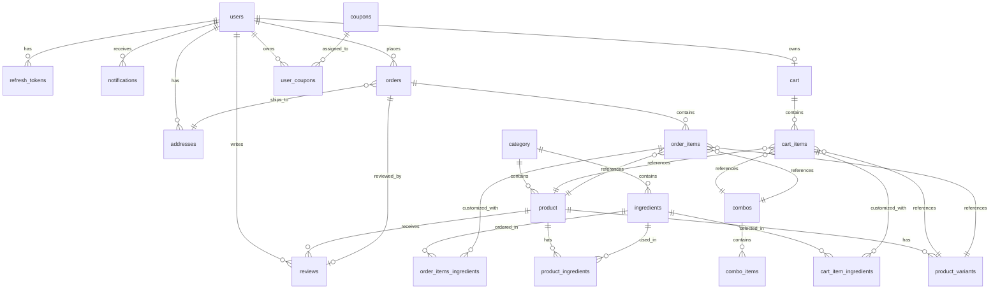

# Tổng Quan Kiến Trúc Cơ Sở Dữ Liệu (Database Schema Summary)

Dự án FastFood sử dụng cơ sở dữ liệu quan hệ (Relational Database) với **20 bảng (Entities)** được thiết kế theo kiến trúc chuẩn hóa, quản lý dữ liệu thông qua TypeORM.

---

## 1. Sơ Đồ Thực Thể Quan Hệ (ERD Diagram)

---

## 2. Thống Kê & Phân Nhóm 20 Bảng

| Nhóm Chức Năng                      | Tên Bảng (Table Name)     | Khóa Chính (PK) | Mô Tả                                                             |
| :---------------------------------- | :------------------------ | :-------------- | :---------------------------------------------------------------- |
| **1. Quản lý Người dùng & Bảo mật** | `users`                   | `id` (UUID)     | Thông tin tài khoản người dùng, phân quyền, sĐT, avatar.          |
|                                     | `refresh_tokens`          | `id` (UUID)     | Lưu vết Refresh Token để làm mới Access Token (HTTP-only cookie). |
|                                     | `addresses`               | `id` (UUID)     | Danh sách địa chỉ giao hàng của người dùng (tọa độ lng/lat).      |
|                                     | `notifications`           | `id` (UUID)     | Thông báo gửi tới người dùng (hệ thống, đơn hàng, khuyến mãi).    |
| **2. Danh mục & Sản phẩm**          | `category`                | `id` (Int)      | Danh mục món ăn / đồ uống (Burger, Pizza, Nước ngọt...).          |
|                                     | `product`                 | `id` (UUID)     | Danh sách món ăn chính, giá cơ bản, hình ảnh, slug.               |
|                                     | `product_variants`        | `id` (Int)      | Các biến thể của món ăn (Size, loại vỏ/đế, giá điều chỉnh).       |
|                                     | `ingredients`             | `id` (Int)      | Danh mục các nguyên liệu/Topping có thể chọn thêm.                |
|                                     | `product_ingredients`     | `id` (UUID)     | Bảng trung gian liên kết Sản phẩm với Nguyên liệu mặc định.       |
|                                     | `combos`                  | `id` (UUID)     | Các gói Combo ưu đãi gồm nhiều món.                               |
|                                     | `combo_items`             | `id` (UUID)     | Danh sách nhóm món/số lượng cho phép trong mỗi Combo.             |
| **3. Giỏ hàng (Cart)**              | `cart`                    | `id` (UUID)     | Giỏ hàng cá nhân của từng người dùng (1-to-1 với `users`).        |
|                                     | `cart_items`              | `id` (UUID)     | Chi tiết các món (Product/Variant/Combo) có trong giỏ hàng.       |
|                                     | `cart_item_ingredients`   | `id` (UUID)     | Các Topping/Nguyên liệu chọn thêm cho món trong giỏ.              |
| **4. Đơn hàng (Orders)**            | `orders`                  | `id` (UUID)     | Đơn đặt hàng, trạng thái thanh toán, phí giao hàng, tổng tiền.    |
|                                     | `order-items`             | `id` (UUID)     | Chi tiết món ăn và số lượng trong đơn hàng.                       |
|                                     | `order-items-ingredients` | `id` (UUID)     | Chi tiết Topping/Nguyên liệu đi kèm với món trong đơn.            |
| **5. Khuyến mãi & Đánh giá**        | `coupons`                 | `id` (UUID)     | Mã giảm giá, điều kiện áp dụng, thời gian hiệu lực.               |
|                                     | `user_coupons`            | `id` (UUID)     | Bảng lưu vết mã giảm giá người dùng đã sở hữu/sử dụng.            |
|                                     | `reviews`                 | `id` (Int)      | Đánh giá sao (rating) và bình luận cho đơn hàng/sản phẩm.         |

---

## 3. Chi Tiết Cấu Trúc Các Bảng (Schema Details)

### 3.1. Nhóm Người Dùng & Bảo Mật

#### Bảng `users`

- **id** (`UUID`, PK): Mã định danh duy nhất.
- **email** (`Varchar`, Unique, Not Null): Email đăng nhập.
- **password** (`Varchar`, Not Null): Mật khẩu đã mã hóa.
- **name** (`Varchar`, Not Null): Họ và tên.
- **so_dien_thoai** / **phone** (`Varchar`, Unique): Số điện thoại.
- **avatar** (`Varchar`, Nullable): Đường dẫn ảnh đại diện.
- **role** (`Enum`: `RoleEnum`): Quyền hạn (`CUSTOMER`, `ADMIN`).
- **provider** (`Varchar`): Phương thức đăng nhập (`local`, `google`,...).
- **createdAt**, **updatedAt**, **deletedAt** (`Timestamp`): Thời gian tạo, sửa, xóa mềm.

#### Bảng `refresh_tokens`

- **id** (`UUID`, PK)
- **token** (`Text`, Unique, Not Null): Chuỗi Refresh Token mã hóa.
- **user_id** (`UUID`, FK -> `users.id`, On Delete CASCADE)
- **expires_at** (`Timestamp`, Not Null): Thời hạn hết hiệu lực.

#### Bảng `addresses`

- **id** (`UUID`, PK)
- **street**, **city**, **district**, **ward** (`Varchar`): Địa chỉ chi tiết.
- **longitude**, **latitude** (`Decimal(10,7)`): Tọa độ định vị GPS.
- **isDefault** (`Integer`, default `1`): Địa chỉ mặc định.
- **userId** (`UUID`, FK -> `users.id`)

#### Bảng `notifications`

- **id** (`UUID`, PK)
- **title** (`Varchar`), **content** (`Text`): Tiêu đề & Nội dung.
- **type** (`Enum`: `NotificationType`): Phân loại thông báo.
- **isRead** (`Boolean`, default `false`): Trạng thái đã đọc.
- **userId** (`UUID`, FK -> `users.id`, Nullable)

---

### 3.2. Nhóm Sản Phẩm, Biến Thể & Nguyên Liệu

#### Bảng `category`

- **id** (`Int`, Auto-increment, PK)
- **name** (`Varchar`), **slug** (`Varchar`): Tên & Slug danh mục.
- **description** (`Text`), **sortOrder** (`Int`), **isActive** (`Int`)

#### Bảng `product`

- **id** (`UUID`, PK)
- **name** (`Varchar`), **slug** (`Varchar`, Unique, Not Null)
- **description** (`Text`), **basePrice** (`Int`, Not Null): Giá gốc.
- **img** (`Varchar`), **isFeatured** (`Int`), **sortOrder** (`Int`), **isActive** (`Int`)
- **categoryId** (`Int`, FK -> `category.id`)

#### Bảng `product_variants`

- **id** (`Int`, Auto-increment, PK)
- **name** (`Varchar`): Tên biến thể.
- **size** (`Enum`: `SizeEnum`), **type** (`Enum`: `TypeEnum`): Kích thước & Loại sản phẩm.
- **modifiedPrice** (`Int`): Giá chênh lệch so với giá gốc.
- **productId** (`UUID`, FK -> `product.id`)

#### Bảng `ingredients`

- **id** (`Int`, Auto-increment, PK)
- **name** (`Varchar`), **imageUrl** (`Varchar`), **description** (`Text`)
- **price** (`Int`): Giá mua thêm nguyên liệu/topping.
- **isRequired** (`Int`), **isActive** (`Int`), **sortOrder** (`Int`)
- **categoryId** (`Int`, FK -> `category.id`)

#### Bảng `product_ingredients`

- **id** (`UUID`, PK)
- **productId** (`UUID`, FK -> `product.id`)
- **ingredientId** (`Int`, FK -> `ingredients.id`)
- **isDefault** (`Int`): Có phải nguyên liệu mặc định của món không.
- **quantity** (`Int`): Số lượng định lượng.

---

### 3.3. Nhóm Giỏ Hàng (Cart)

#### Bảng `cart`

- **id** (`UUID`, PK)
- **userId** (`UUID`, FK -> `users.id`, Unique)
- **totalCartPrice** (`Int`), **totalItemDiff** (`Int`), **totalItems** (`Int`)

#### Bảng `cart_items`

- **id** (`UUID`, PK)
- **cartId** (`UUID`, FK -> `cart.id`)
- **productId** (`UUID`, FK -> `product.id`, Nullable)
- **productVariantId** (`Int`, FK -> `product_variants.id`, Nullable)
- **comboId** (`UUID`, FK -> `combos.id`, Nullable)
- **quantity** (`Int`), **price** (`Int`), **options** (`JSON`, Nullable)

#### Bảng `cart_item_ingredients`

- **id** (`UUID`, PK)
- **cartItemId** (`UUID`, FK -> `cart_items.id`)
- **ingredientId** (`Int`, FK -> `ingredients.id`)
- **quantity** (`Int`)

---

### 3.4. Nhóm Đơn Hàng & Khuyến Mãi

#### Bảng `orders`

- **id** (`UUID`, PK)
- **orderNumber** (`Varchar`, Unique): Mã đơn hàng hiển thị (ví dụ: `ORD-123456`).
- **status** (`Enum`: `OrderStatus`): Trạng thái đơn hàng.
- **paymentStatus** (`Enum`: `PaymentStatus`), **paymentMethod** (`Enum`: `PaymentMethod`)
- **subTotal**, **deliveryFee**, **discount**, **total** (`Int`): Các khoảng chi phí.
- **userId** (`UUID`, FK -> `users.id`, Nullable - hỗ trợ khách vãng lai).
- **addressId** (`UUID`, FK -> `addresses.id`, Nullable)
- **guestName**, **guestPhone**, **guestEmail**, **guestAddress** (`Varchar` / `Text`: Thông tin khi mua không cần tài khoản).

#### Bảng `order-items`

- **id** (`UUID`, PK)
- **orderId** (`UUID`, FK -> `orders.id`)
- **productId** (`UUID`, FK -> `product.id`), **productVariantId** (`Int`), **comboId** (`UUID`)
- **quantity** (`Int`), **price** (`Int`), **options** (`JSON`)

#### Bảng `order-items-ingredients`

- **id** (`UUID`, PK)
- **orderItemId** (`UUID`, FK -> `order-items.id`)
- **ingredientId** (`Int`, FK -> `ingredients.id`)
- **quantity** (`Int`)

#### Bảng `coupons`

- **id** (`UUID`, PK)
- **code** (`Varchar`, Not Null): Mã giảm giá (ví dụ: `SUMMER2026`).
- **name** (`Varchar`), **value** (`Int`): Số tiền/Giá trị giảm.
- **minOrderAmount** (`Int`), **maxUser** (`Int`), **currentUses** (`Int`)
- **startDate**, **endDate** (`Timestamp`), **isActive** (`Int`)

#### Bảng `user_coupons` (Index Unique: `[userId, couponsId]`)

- **id** (`UUID`, PK)
- **userId** (`UUID`, FK -> `users.id`)
- **couponsId** (`UUID`, FK -> `coupons.id`)
- **isUsed** (`Int`, default `0`), **user_at** (`Timestamp`, Nullable)

#### Bảng `reviews`

- **id** (`Int`, Auto-increment, PK)
- **rating** (`Int`, Not Null): Điểm đánh giá (1 - 5 sao).
- **comment** (`Text`): Nội dung đánh giá.
- **userId** (`UUID`, FK -> `users.id`)
- **productId** (`UUID`, FK -> `product.id`)
- **order_id** (`UUID`, FK -> `orders.id`, Unique 1-to-1)
